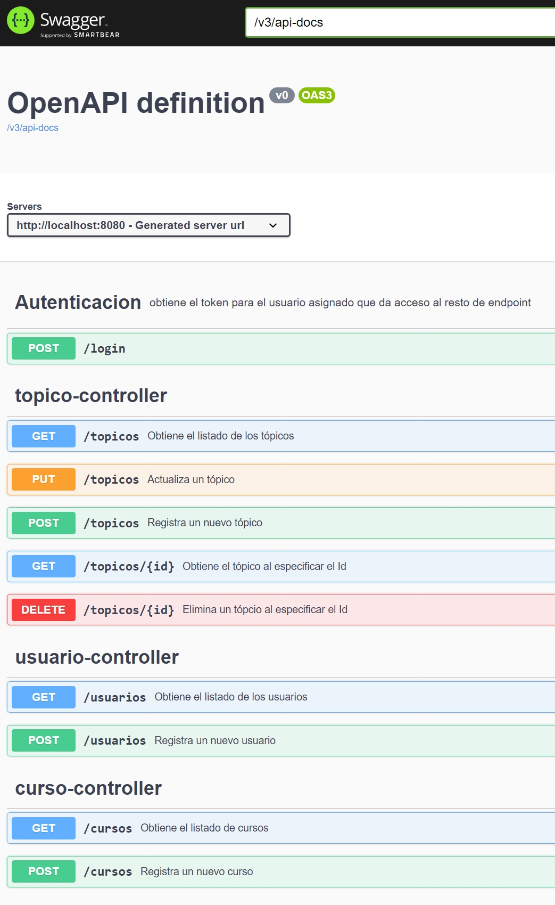
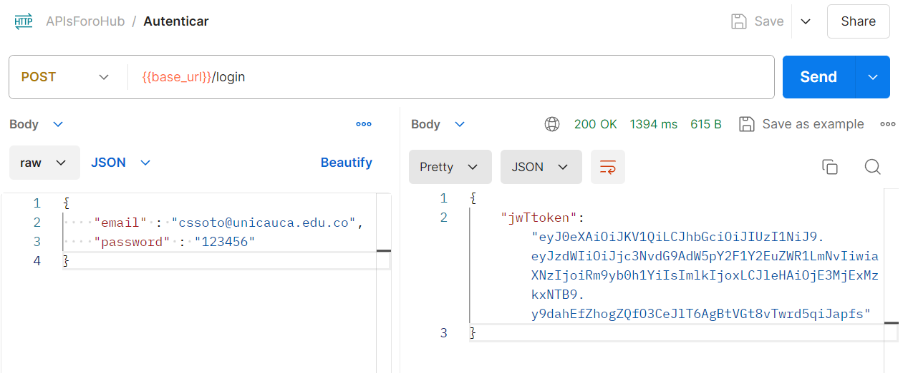
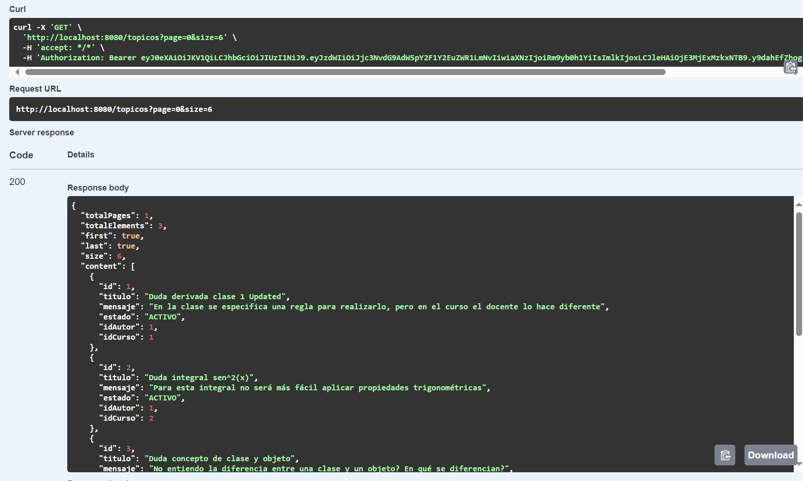
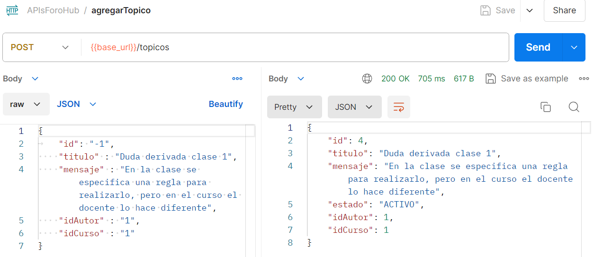
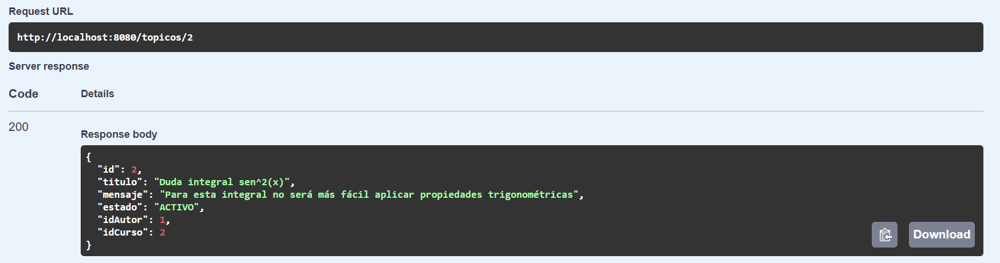
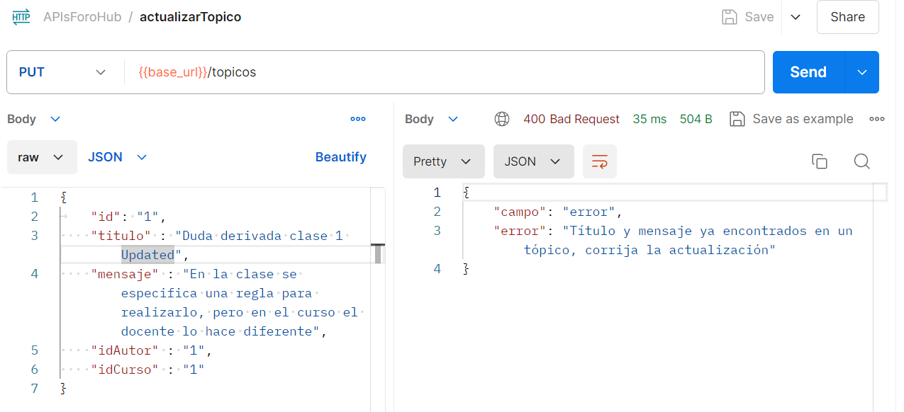
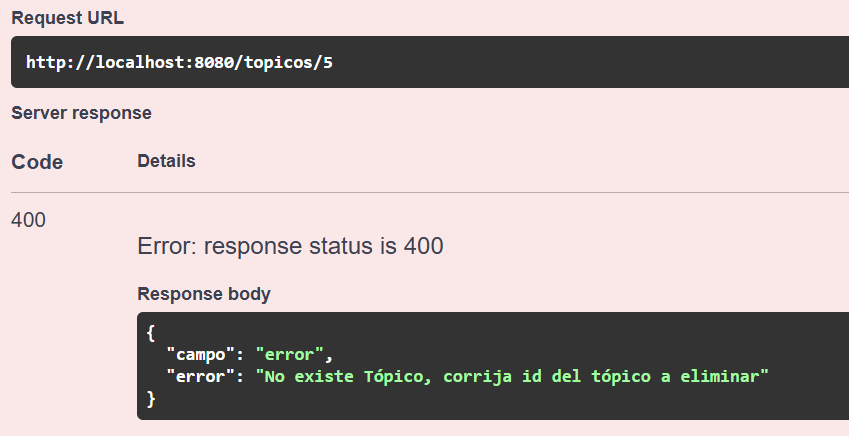
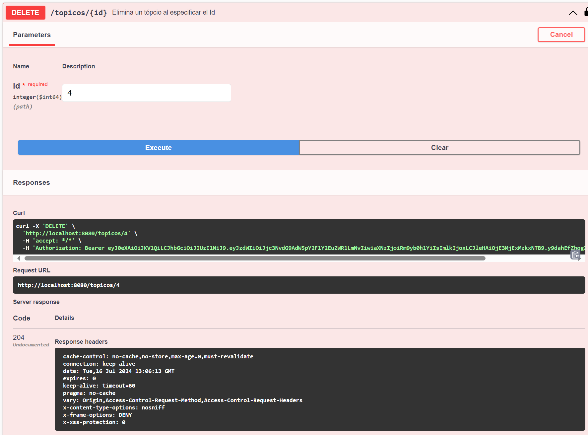

<h1>ForoHub: Challenge del curso de Alura y Microsoft One</h1>

Se propone solución al desafío ForoHub: Challenge del curso de Alura y Microsoft One para desarrollar una API Rest usando Spring con el objetivo de implementar un CRUD. Se utiliza Liquibase para el versionamiento de la base de datos MySQL, además de la utilización de Spring Security y buenas prácticas para el desarrollo de una API REST

Se utiliza la dependencia Swagger para la documentación de la API Rest implementada. Los endpoints disponibles de la API son:

Al ejecutar el proyecto, se tiene el siguiente usuario por defecto para ser usado y probar la distintas funcionalidades de la API Rest:

Dentro de las funcionalidades solicitadas por el reto, se tiene:

1) Listar tópicos: El proyecto cuenta con unos tópicos ya creados en la BBDD. Se implementa paginación para listar los tópicos.

2) Registrar Nuevo tópico: Se registra nuevo tópico, validando que el id sea igual a -1 (Lo que lo diferencia con actualizar), además de implementar
la regla de negocio de no registrar un tópico con título y mensaje duplicados.

3) Detallar tópico especifico: Se implementa la funcionalidad de detallar tópico por Id. La API Rest válida que el id especificado no sea nulo,
además que exista en la base de datos. 

4) Actualizar tópico: Se implementa endpoint de actualizar tópico. Al actualizar, debe existir el identificador del curso y del autor, de lo contrario se 
tendrá un error. Además, el título y mensaje a actualizar no deben de ya estar registrados, o se tendrá el siguiente error

5) Eliminar tópico: Se debe de especificar el Id del tópico a eliminar. De no existir, se tendrá un error cómo la siguiente imagen: 

En caso de existir, eliminará de forma permanente el tópico por el id específicado, obteniendo una respuesta 204. 

<h1>Muchas gracias, quedo atento a su comentario y opiniones.</h1>